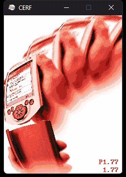
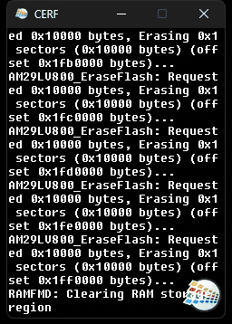
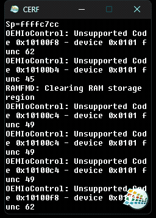
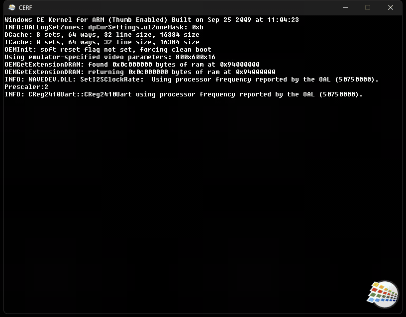
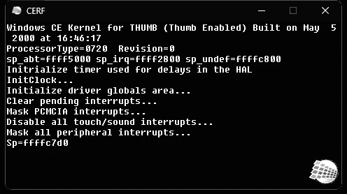

#  **CE Runtime Foundation** v2

A universal Windows CE emulator: a virtual ARM hardware platform that boots real CE and Windows Mobile ROMs on modern Windows.

> [!WARNING]
> **Early stage.** There are some bugs and boards are just MVP implementations. Some boards lack proper clocks, etc. - take into account. Today this is rather proof-of-concept. Contributions are welcome!

<p align="center">
  
  
  
</p>
<p align="center">
  
  
</p>

## Usage

| Command | Action |
| - | - |
| ``cerf.exe `` | Boot default device (ce5_smdk2410) |
| ``cerf.exe --device=ce6_smdk2410_devemu`` | Boot specific device |
| ``cerf.exe --flush-outputs`` | Force-flush logs (avoid truncation on crash, extremely slow) |

Logs are written to `cerf.log` next to the executable. On a fatal crash, every other thread's register state and a top-of-stack snapshot is dumped to `cerf.crash.log` next to it through a lock-free emergency writer (no ucrt, no mutexes). Run `cerf.exe --help` for the full CLI.

> [!TIP]
> **For fastest runtime, pass `--quiet`.** Logging dominates the hot path; disable it for performance runs.

## Supoprted boards

| Board | Device(s) | OS | Bootable | MVP usable/status |
| ----- | --------- | -- | -------- | --------------- |
| Device Emulator (CE 5+) | `ce6_smdk2410_devemu`, `wm5_smdk2410_devemu` | Windows CE 6, Windows Mobile 5+ | ✅ | Graphics, sound, touch, keyboard, NE2000 Emulator |
| ODO/Poseidon - Microsoft Internal 1996 NDA Board | `ce3_poseidon` | Windows CE 3 | ✅ | Grayscale graphics, basic sound, touch, keyboard |
| Compaq iPAQ 3650 (Intel SA-1110) | `ppc2000_ipaq3650` | Pocket PC 2000 | ✅ | Graphics, basic sound, touch |
| OMAP 3530 | `ce7_omap_3530_evm` | Windows CE 7 | 🚧 | WIP |
| Device Emulator (CE 4/WM 2003) | `wm2003se_smdk2410_devemu` | Windows CE .NET 4.2, Windows Mobile 2003 SE | 🔜 | Known to have different branch in Device Emulator itself, but not implemented in CERF |
| PB SMDK 2410 Sample | `ce5_smdk2410` | Windows CE 5 | 🔜 | Not implemented |

## How CERF runs ROM images? (NK.BIN, etc.)

Each device under `devices/<name>/` contains a Windows CE ROM image (`*.nb0` or `*.bin`).

Each device declares a `cerf.json` describing itself and (optionally) overriding board / network / rom defaults:

```json
{
  "meta": {
    "device_name": "Microsoft Device Emulator (Windows Mobile 5 Pocket PC)",
    "board_name":  "Device Emulator",
    "soc_family":  "Samsung S3C2410 (ARM920T)",
    "os":          { "name": "Windows Mobile", "ver_major": 5, "ver_minor": 0 },
    "device_year": 2005
  },
  "board": {
    "configurable_screen_width":  800,
    "configurable_screen_height": 600
  },
  "rom": {
    "primary":    "NK.bin",
    "extensions": "EXT.bin",
    "recovery":   "Recovery.bin"
  }
}
```

`meta` is informational (device identification for the launcher / status displays — SoC and Board selection at runtime still come from BoardDetector heuristics on the ROM). `board` is only honoured by BSPs with a configurable screen resolution (today only Device Emulator boards). `rom` is only needed when a device ships more than one partition; single-ROM devices auto-detect the `*.nb0` / `*.bin`.

See [device_config.h](cerf/core/device_config.h) for the full schema.

To determine what is the board, CERF looks inside of ROM and performs heuristic search by module names or binary blobs. 

## Building

Requires Visual Studio 2026 with the C++ desktop development workload.

> [!NOTE]
> **First build on a fresh machine takes 1+ hour.** vcpkg compiles dependencies from source before CERF starts linking. This happens once per machine — subsequent builds reuse the cached `vcpkg_installed/` tree and finish in a few minutes. Do not interrupt the first build.

Initialise source/dependency submodules:

```
git submodule update --init --recursive
```

Build via the helper script:

```
powershell -ExecutionPolicy Bypass -File build.ps1
```

Or invoke msbuild directly:

```
msbuild cerf.sln /p:Configuration=Release /p:Platform=Win32
```

## Third-party

- JIT studied/inspired by Microsoft's Device Emulator (Shared Source Academic License, 2006)
- **[nlohmann-json](https://github.com/nlohmann/json)** — header-only JSON parser.
- **[libslirp](https://gitlab.freedesktop.org/slirp/libslirp)** — user-mode TCP/IP stack behind the virtual NDIS miniport (DHCP, DNS, TCP, UDP, IPv4, IPv6 via SLAAC). No admin or driver install required; pulled in automatically via vcpkg on first build.

## Roadmap

See [roadmap.md](docs/roadmap.md)

## What happened to CERF v1?

> [!NOTE]
> CERF v1 reimplemented CE userspace + kernel in host C++ - coredll exports thunked, rehosted on Win32. It hit a hard ceiling: per-process host resources (GDI handles, atom tables, kernel handles) couldn't hold an entire guest OS, because v1 mocked CE at the user-API layer instead of below CE's own per-process isolation. v1 was overengineering hell that literally grew exponentially. v2 is a completely different project. v1's source lives at [cerf-v1-obsolete](https://github.com/gweslab/cerf/tree/cerf-v1-obsolete).

## AI-generated code

100% generated by [Claude](https://claude.ai) via [Claude Code](https://docs.anthropic.com/en/docs/claude-code) — no human-written code. Not production-grade.

## Downloads

[](https://github.com/dz333n/cerf/actions/workflows/build.yml)
