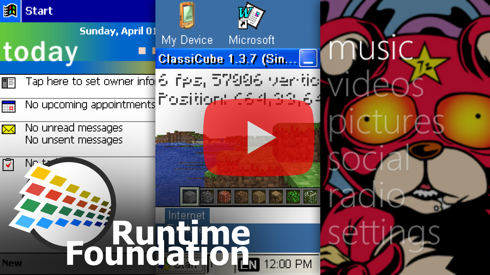
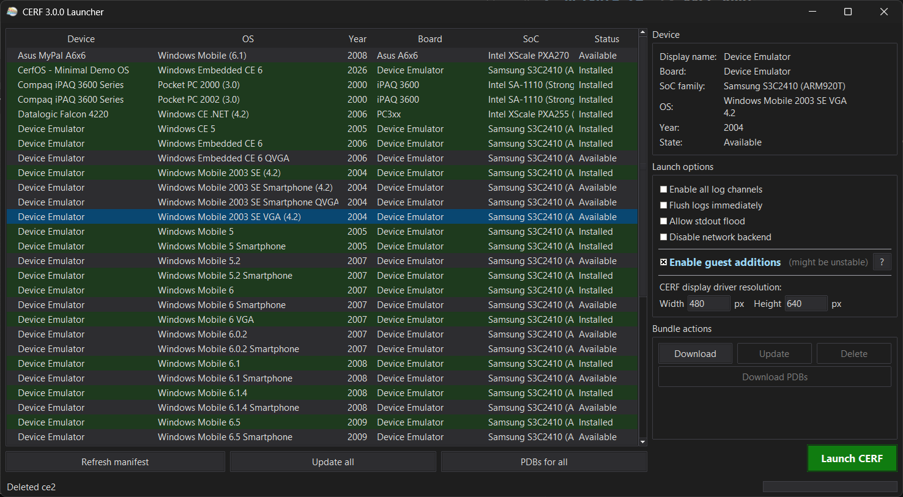

#  **CE Runtime Foundation** v{version} pre-alpha [](https://discord.gg/QREE9Y2v2d)

A universal Windows CE emulator: a virtual ARM hardware platform that boots real CE and Windows Mobile ROMs on modern Windows.

<p align="center">
  <a href="https://www.youtube.com/watch?v=LmfaXUNGFlU">
    
  </a>
</p>

> [!WARNING]
> **Early stage.** There are some bugs and boards are just MVP implementations. Some boards lack proper clocks, timings, caches, etc. - take into account. Today this is rather proof-of-concept. Contributions are welcome!

> [!TIP]
> Stock touch input is misbehaving in some devices/requires some additional effort. If your clicks do not register, try holding the left button and wiggling the cursor a bit.


## Usage

The easiest way to run CERF is **`launcher.exe`** — a GUI app shipped next to `cerf.exe` that downloads publicly available ROM bundles and boots them. Pick a device from the list, tweak launch options (resolution, logging, network) if you want, click **Launch CERF**.



For direct invocation without the launcher:

| Command                        | Action                                                       |
| ------------------------------ | ------------------------------------------------------------ |
| `cerf.exe `                    | Boot default device (cerfos)                                 |
| `cerf.exe --device=devemu_ce6` | Boot specific device                                         |
| `cerf.exe --log=ALL`           | Enable every log channel                                     |
| `cerf.exe --flush-outputs`     | Force-flush logs (avoid truncation on crash, extremely slow) |

Logs are written to `cerf.log` next to the executable. On a fatal crash, every other thread's register state and a top-of-stack snapshot is dumped to `cerf.crash.log` next to it. Run `cerf.exe --help` for the full CLI.

> [!NOTE]
> **`cerf.log` is quiet by default** — only critical `CERF` / `CAUTION` lines are written. Pass `--log=ALL` (or a channel list, e.g. `--log=BOOT,JIT,MMU`) to turn channels on.

##  Guest Additions

> [!WARNING]
> **Experimental and unstable.** Guest Additions are opt-in (`--guest-additions`), off by default. Expect per-device rendering glitches and reduced stability — some guest OSes behave better than others.

<p align="center">
  
</p>

## Supported boards

{supported_devices}

## How CERF runs ROM images? (NK.BIN, etc.)

Each device under `devices/<name>/` contains a Windows CE ROM image (`*.nb0` or `*.bin`) and each device declares an optional `cerf.json` describing itself and (optionally) overriding board / network / rom defaults:

```json
{
  "meta": {
    "device_name": "Microsoft Device Emulator (Windows Mobile 5 Pocket PC)",
    "board_name": "Device Emulator",
    "soc_family": "Samsung S3C2410 (ARM920T)",
    "os": { "name": "Windows Mobile", "ver_major": 5, "ver_minor": 0 },
    "device_year": 2005
  },
  "board": {
    "configurable_screen_width": 800,
    "configurable_screen_height": 600
  },
  "rom": {
    "primary": "NK.bin",
    "extensions": "EXT.bin",
    "recovery": "Recovery.bin"
  }
}
```

`meta` is informational (device identification for the launcher / status displays). `board` is only honoured by BSPs with a configurable screen resolution (today only Device Emulator boards). `rom` is only needed when a device ships more than one partition; single-ROM devices auto-detect the `*.nb0` / `*.bin`.

See [device_config.h](cerf/core/device_config.h) for the full schema.

##  Claude Development Environment

CERF ships a Claude Code-based development environment for working on the emulator — including bringing up brand-new boards from their ROMs. Launch it from the repo root with:

```
run_claude.cmd
```

It runs Claude Code with a custom system prompt that injects the **entire project documentation** (`CLAUDE.md` plus every `agent_docs/` reference page) into every agent, so each session starts fully briefed on the project's rules, architecture, and subsystems — no "please read the docs first" needed.

The environment provides the **`/start-board-implementation`** skill: drop your ROM into `bundled/devices/` (or just point the agent at it) and run the skill. The agent identifies the board and SoC straight from the ROM, checks what CERF already supports, estimates the effort, and — on your go-ahead — starts the bring-up with a cross-session tracking document. So you can literally drop in your ROM and start the procedure of bringing it up.

> [!WARNING]
> The dev environment runs Claude in skip-permissions mode — it can execute anything on your machine without prompting. It also force-kills its own Claude instance, and **any** `clangd.exe`, that leaks memory past a threshold. The first launch shows a one-time explanation; press Enter to acknowledge it.

## Building

Requires Visual Studio 2026 with the C++ desktop development workload.

> [!NOTE]
> **First build on a fresh machine takes 1+ hour.** vcpkg compiles dependencies from source before CERF starts linking. This happens once per machine — subsequent builds reuse the cached `vcpkg_installed/` tree and finish in a few minutes. Do not interrupt the first build.

Initialise source/dependency submodules:

```
git submodule update --init --recursive
```

Build via the helper script:

```
powershell -ExecutionPolicy Bypass -File build.ps1
```

Or invoke msbuild directly:

```
msbuild cerf.sln /p:Configuration=Release /p:Platform=Win32
```

## Third-party / Credits

- **[QEMU](https://www.qemu.org/)**
- **[The Linux kernel](https://www.kernel.org/)**
- **[nlohmann-json](https://github.com/nlohmann/json)**
- **[libslirp](https://gitlab.freedesktop.org/slirp/libslirp)**
- JIT studied/inspired by Microsoft's Device Emulator (Shared Source Academic License, 2006)

## Known Issues

See [launcher's boards details database](launcher/supported_devices.py) for per-board issues.

## Changelog

{changelog}

## What happened to CERF v1?

> [!NOTE]
> CERF v1 reimplemented CE userspace + kernel in host C++ - coredll exports thunked, rehosted on Win32. It hit a hard ceiling: per-process host resources (GDI handles, atom tables, kernel handles) couldn't hold an entire guest OS. v1 was overengineering hell that literally grew exponentially. v2 is a completely different project. v1's source lives at [cerf-v1-obsolete](https://github.com/gweslab/cerf-v1-obsolete).

## AI-generated code

> [!CAUTION]
> **DO NOT USE CERF CODEBASE AS REFERENCE FOR SoCs, BOARDS, PERIPHERALS** - AI WRITTEN CODE CAN'T BE TRUSTED!

100% generated by [Claude](https://claude.ai) via [Claude Code](https://docs.anthropic.com/en/docs/claude-code) — no human-written code. Not production-grade.

## Downloads

Download WIP build ({version}) from artifacs [](https://github.com/gweslab/cerf/actions/workflows/build.yml) or go to [latest release](https://github.com/gweslab/cerf/releases/latest)
